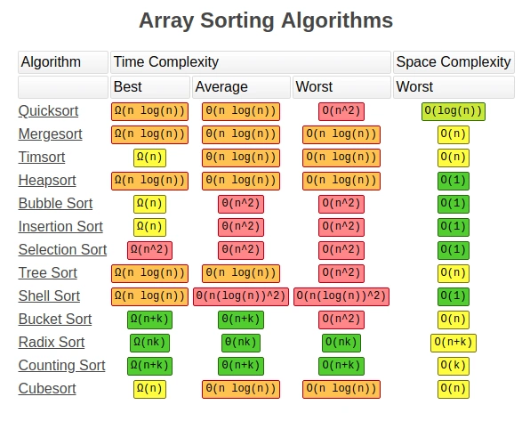

# 排序算法的实现与对比🎢

<div align="center">
    
</div>

## 快速排序（quick_sort）

`基本思想`：本质上是一种分而治之的思想。

1. 选定Pivot中心轴
2. 将大于Pivot的数字放在Pivot的右边
3. 将小于Pivot的数字放在Pivot的左边
4. 分别对左右子序列重复前三步操作，直到各子序列中的元素个数为1

### 一行实现（Lambda）

> 并非原地排序

```python
quick_sort = lambda array: array if len(array) <= 1 else quick_sort([item for item in array[1:] if item <= array[0]]) + [array[0]] + quick_sort([item for item in array[1:] if item > array[0]])
```

### 递归实现（Recursion）

```python
def quick_sort(array, l, r):
        if l < r:
            mid = partition(array, l, r)
            quick_sort(array, l, mid - 1)
            quick_sort(array, mid + 1, r)

def partition(array, l, r):
    value = array[r]
    index = l - 1
    for ind in range(l, r):
        if array[ind] <= value:
            index += 1
            array[index], array[ind] = array[ind], array[index]
    array[index + 1], array[r] = array[r], array[index + 1]
    return index + 1
```

### 非递归实现（Stack）

```python
def quick_sort(array, l, r):
    if l >= r:
        return
    stack = []
    stack.append(l)
    stack.append(r)
    while stack:
        low = stack.pop(0)
        high = stack.pop(0)
        if high - low <= 0:
            continue
        value = array[high]
        index = low - 1
        for ind in range(low, high):
            if array[ind] <= value:
                index += 1
                array[index], array[ind] = array[ind], array[index]
        array[index + 1], array[high] = array[high], array[index + 1]
        stack.extend([low, index, index+2, high])
```

### 排序时间对比

```python
from collection.quick_sort import Lambda, Recursion, Stack
def test_Quicksort(array, l=0, r=9999):
    method_list = ["Lambda", "Recursion", "Stack"]
    dictionary = {}
    for method in method_list:
        function = eval(method)
        arr = copy.deepcopy(array) # 深度复制
        if method == "Lambda":
            times = time.time()
            function(arr)
            timee = time.time()
        else:
            times = time.time()
            function(arr, l, r)
            timee = time.time()
        gap = round(timee - times, 2)
        gap_list = [gap]
        dictionary[method] = gap_list
    df = pl.DataFrame(dictionary)
    return df
print(test_Quicksort(data))
```

```textile
shape: (1, 3)
┌────────┬───────────┬───────┐
│ Lambda ┆ Recursion ┆ Stack │
│ ---    ┆ ---       ┆ ---   │
│ f64    ┆ f64       ┆ f64   │
╞════════╪═══════════╪═══════╡
│ 0.1    ┆ 0.14      ┆ 0.15  │
└────────┴───────────┴───────┘
```

## 归并排序（merge_sort)

`基本思想`：归并排序采用分治法，先递归拆分数组，再合并数组，一种非原地排序方法。

### 递归实现（Recursion）

```python
def merge_sort(array):
    if len(array) <= 1:
        return array
    mid = len(array) // 2
    left = merge_sort(array[:mid])
    right = merge_sort(array[mid:])
    return merge(left, right)

def merge(l, r):
    result = []
    i = 0
    j = 0
    while i < len(l) and j < len(r):
        if(l[i] <= r[j]):
            result.append(l[i])
            i += 1
        else:
            result.append(r[j])
            j += 1
    result += l[i:]
    result += r[j:]
    return result
```

### 非递归实现（Stack）

非递归版本不需要额外的空间。直接在原数组上进行切割合并。

```python
def merge(array, low, mid, high):
    left = array[low: mid]
    right = array[mid: high]
    i = 0
    j = 0
    result = []
    while i < len(left) and j < len(right):
        if left[i] <= right[j]:
            result.append(left[i])
            i += 1
        else:
            result.append(right[j])
            j += 1
    result += left[i:]
    result += right[j:]
    array[low: high] = result

def merge_sort(array):
    i = 1
    while i < len(array):
        low = 0
        while low < len(array):
            mid = low + i
            high = min(low + 2 * i, len(array))
            if mid < high:
                merge(array, low, mid, high)
            low += 2 * i
        i *= 2
```

### 排序时间对比

```python
# 归并排序算法的对比
from collection.merge_sort import Recursion, Stack
def test_Mergesort(array):
    method_list = ["Recursion", "Stack"]
    dictionary = {}
    for method in method_list:
        function = eval(method)
        if method == "Recursion":
            times = time.time()
            function(array)
            timee = time.time()
        else:
            arr = copy.deepcopy(array) # 深度复制
            times = time.time()
            function(arr)
            timee = time.time()
        gap = round(timee - times, 2)
        gap_list = [gap]
        dictionary[method] = gap_list
    df = pl.DataFrame(dictionary)
    return df
print(test_Mergesort(data))
```

```textile
shape: (1, 2)
┌───────────┬───────┐
│ Recursion ┆ Stack │
│ ---       ┆ ---   │
│ f64       ┆ f64   │
╞═══════════╪═══════╡
│ 0.07      ┆ 0.07  │
└───────────┴───────┘
```

## LICENSE

[MIT LICENSE](./LICENSE)